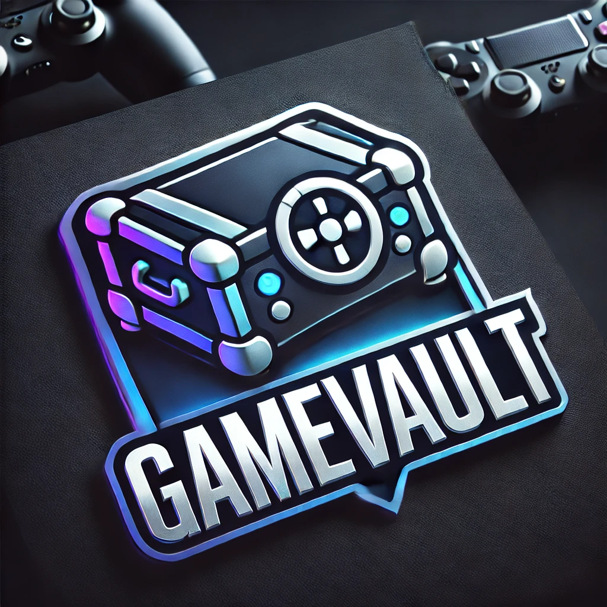

# Game Vault

<p align="center">
  
</p>

Game Vault is your ultimate platform for discovering, downloading, and managing games. Designed for gamers, by gamers, it combines a sleek interface with powerful features to enhance your gaming experience.

---

## 🚀 Features

- 🎮 **Game Discovery**: Browse, search, and explore a wide range of games.
- 🌟 **User-Friendly Interface**: Built with Tailwind CSS for a clean, modern, and responsive design.
- ⚡ **Performance Optimized**: Leveraging React and TypeScript for fast and maintainable development.
- 🔄 **Seamless Updates**: Enjoy hassle-free updates for the platform and its features.

---

## 🛠 Tech Stack


---

## 🚧 Getting Started

Follow these steps to set up and run Game Vault on your local machine:

### Prerequisites

- 📦 Node.js (v14 or newer)
- 🧰 npm or yarn

### Installation

1. **Clone the repository**:
   ```bash
   git clone https://github.com/your-username/game-vault.git
   ```

2. **Navigate to the project directory**:
   ```bash
   cd game-vault
   ```

3. **Install dependencies**:
   ```bash
   npm install
   # or
   yarn install
   ```

### Running the Development Server

Start the development server:
```bash
npm run dev
# or
yarn dev
```

Open [http://localhost:3000](http://localhost:3000) to view the app in your browser.

---

## 🤝 Contributing

We welcome contributions from the community! Follow these steps:

1. **Fork the repository**.
2. **Create a new branch**:
   ```bash
   git checkout -b feature-name
   ```
3. **Commit your changes**:
   ```bash
   git commit -m 'Add feature'
   ```
4. **Push to the branch**:
   ```bash
   git push origin feature-name
   ```
5. **Open a pull request**.

Feel free to check out the [CONTRIBUTING.md](CONTRIBUTING.md) file for more details.

---

## 📄 License

This project is licensed under the MIT License. See the [LICENSE](LICENSE) file for details.

---

## 📧 Contact

For inquiries, suggestions, or support, reach out to us at [your-email@example.com](mailto:your-email@example.com).

---

## 🎉 Thank You

Thank you for choosing Game Vault! We hope you enjoy your gaming adventures with us. Don't forget to ⭐ the repository if you find it helpful!
```
